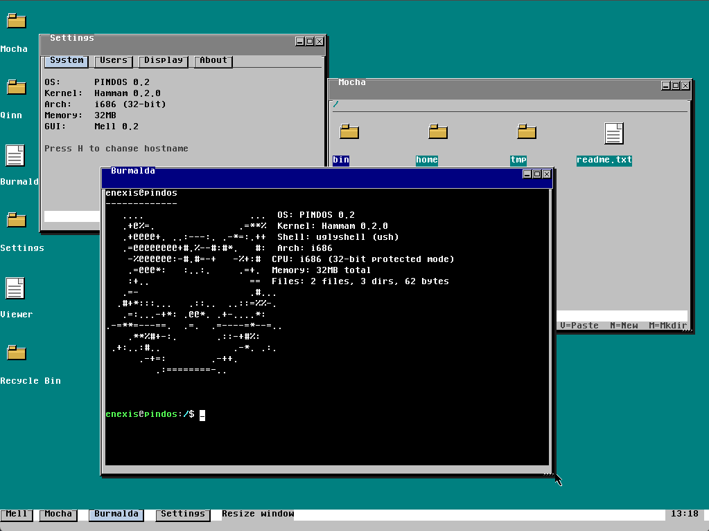

## Unix-подобная операционная система для архитектуры x86, ветка Mainline в данный момент подвергается масштабному рефакторингу системы, чтобы ядро Hammam имело полную поддержку GNU софта нативно.

---
